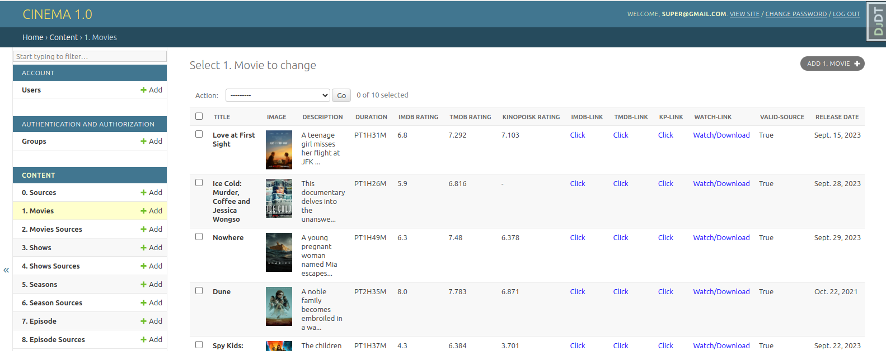

# Cinema Project

Cinema is a movie viewing project that aggregates films from various sources such as Kinopoisk, IMDb, TMD, and allows downloading. The application utilizes Docker for containerization, Celery for asynchronous task processing, Redis for task queue management, and PostgreSQL as the database. It automatically synchronizes and updates data from sources, checking link availability 24/7.

**Screen:**


## Installation

1. Clone the repository:

    ```bash
    git clone https://github.com/django-level-up/cinema.git
    ```

2. Add the .env file to:

    ```
    cd infrastructure/dev/
    ```

3. Run Docker Compose:

    ```bash
    docker-compose -f infrastructure/dev/docker-compose.yml up --build
    ```

4. Stop the server and load initial data:

    ```bash
    docker-compose -f infrastructure/dev/docker-compose.yml run --rm cinema_app_dev sh -c "python3 manage.py import_movies && python3 manage.py import_shows"
    ```

    Then start again:

    ```bash
    docker-compose -f infrastructure/dev/docker-compose.yml up 
    ```

5. Go to [localhost:8000/admin/](http://localhost:8000/admin/) and log in with the following credentials:
   - Email: super@gmail.com
   - Password: super

6. Browse movies and test the API using Swagger. Go to [localhost:8000/swagger/](http://localhost:8000/swagger/) and log in with the following credentials:
